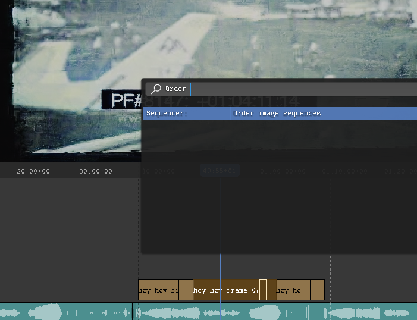
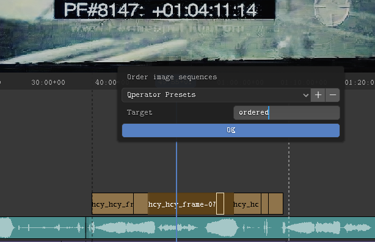
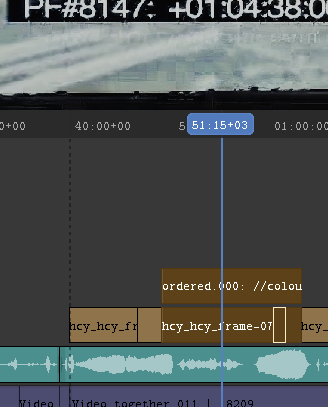

= Blender addon: VSE Order images sequences

This addon is for when you've edited a bunch of image sequences on the VSE editor and would like to consolidate the edit without re-encoding all the images.

You can, on the VSE, select the set of clips you want to “order”, search for _Order image sequences_

The addon will open a dialog where you can choose the name of the output folder and strip.

The addon will create a folder, copy all the images in order, and create a new strip with the consolidated frames.

